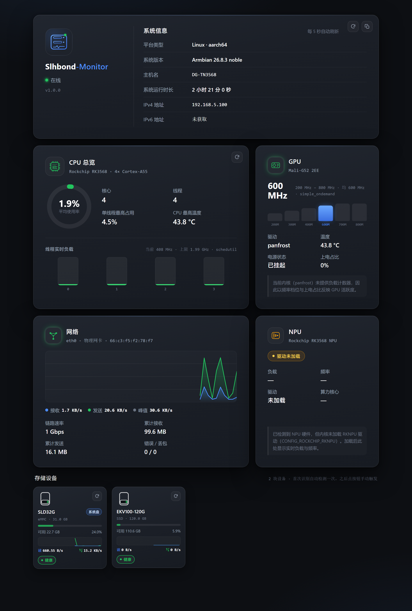

# Slhbond-Monitor

纯 C 写的轻量级 Linux 系统监控。单个可执行文件、只依赖 **libc + pthread**，
自带一个暗色仪表盘网页：系统信息、CPU 总览、GPU、网络波形、NPU、
以及每块硬盘一个方块的存储设备区。

**不绑定任何板子或发行版** —— 同一份源码在 x86_64 服务器、树莓派、
RK3568 这类 ARM 板子上都能原生编译运行，各自识别出自己有的硬件。



---

## 目录

- [特性](#特性)
- [资源占用](#资源占用)
- [快速开始](#快速开始)
- [部署脚本](#部署脚本)
- [支持平台与识别范围](#支持平台与识别范围)
- [面板说明](#面板说明)
- [HTTP 接口](#http-接口)
- [配置](#配置)
- [代码地图](#代码地图)
- [安全说明](#安全说明)
- [排错](#排错)
- [设计取舍](#设计取舍)

---

## 特性

- **零第三方依赖** —— 不链接 OpenSSL、不引入任何 JSON 库，`make` 即可。
  整个二进制约 490 KB。
- **跨架构跨发行版** —— 只读标准的 `/proc` 与 `/sys`，不依赖厂商 SDK、
  不做板子型号白名单。ARM 与 x86 都是原生编译。
- **模块化源码** —— 每个 `.c` 只负责一件事，接口写在同名 `.h` 里，
  见[代码地图](#代码地图)。
- **前端不编译** —— HTML/CSS/JS 放在 `web/`，改完刷新浏览器即可。
- **实时** —— 前端定时轮询，CPU 逐核负载、网络吞吐、磁盘读写都带历史序列，
  波形能看出突发。
- **开机自启** —— 部署脚本自动适配 systemd / OpenRC / SysV / cron。
- **不编造数据** —— 拿不到的指标返回 `null` 并说明原因（GPU 负载计数器、
  未加载的 NPU 驱动、读不到的温度），而不是给一个恒定的假值。

---

## 资源占用

在 RK3568（4× Cortex-A55，Armbian 26.8.3，内核 6.18.37）上实测：

| 场景 | CPU（单核口径） | 占整机 4 核 | 常驻内存 |
| --- | --- | --- | --- |
| 空闲（无任何客户端） | 1.07% | **0.27%** | 2.7 MB |
| 常规使用（仪表盘每 2 秒轮询） | 1.00% | **0.25%** | 2.7 MB |
| 12 客户端并发压测（持续 20 秒） | 27.5% | **6.9%** | 2.7 MB |
| 触发一次硬盘健康检测 | 10 毫秒 | — | 2.7 MB |

- **内存不随负载增长。** 三种场景下 RSS 都是 2.7 MB，峰值 3.5 MB。
  并发请求靠 `cache_ms`（默认 900 毫秒）复用同一份采集快照，
  不会让每个连接各读一遍 `/proc`。
- **空闲时的 CPU 主要来自定时任务**：版本检查线程，以及前端轮询触发的采样。
  把 `poll_ms` 调大、或关掉 `update_check`，还能更低。
- **硬盘健康检测几乎不占本进程 CPU**：`smartctl` 是独立子进程，
  父进程只负责等待与解析，实测 10 毫秒。
- **体积**：可执行文件 490 KB（500,840 字节），安装目录 5.9 MB
  （大头是文档截图），运行状态数据 12 KB。

连续运行 2.5 小时，累计消耗 1.29 秒 CPU 时间。

---

## 快速开始

```bash
# 解压后进入目录
tar xzf slhbond-monitor-1.0.0.tar.gz
cd slhbond-monitor-1.0.0

# 一键部署（会显示菜单）
sudo ./deploy.sh
```

菜单只有三项：

```
    1) 部署项目
    2) 卸载项目
    3) 退出
```

选 `1` 之后脚本会自动完成：检查并安装编译依赖 → 本机原生编译 →
安装到 `/opt/slhbond-monitor` → 写配置 → 注册开机自启 → 启动并自检。

完成后终端会直接给出访问地址：

```
  访问地址  http://192.168.5.100:8090/
```

也可以用非交互方式（适合放进自动化脚本）：

```bash
sudo ./deploy.sh install      # 直接部署
sudo ./deploy.sh uninstall    # 卸载（会问是否保留配置）
sudo ./deploy.sh purge        # 卸载并删除全部配置与数据
sudo ./deploy.sh status       # 查看运行状态 + 接口自检
```

---

## 部署脚本

`deploy.sh` 是唯一的安装入口，几个要点：

**自动安装编译依赖。** 识别 apt / dnf / yum / pacman / zypper / apk，
缺少 gcc 或 make 时自动装（设置 `SLH_NO_DEPS=1` 可关闭）。
同时会尽量装上 `smartmontools`，硬盘健康检测需要它。

**自动适配开机自启。** 按 `systemd → OpenRC → SysV init → cron @reboot`
的顺序探测，用哪个就注册哪个，都不支持时会明确告诉你"能跑但重启后不会自动运行"。

> 已实测：`systemctl reboot` 后服务由开机流程自动拉起（boot_id 变更、
> uptime 归零、MainPID 为全新进程），10 个接口全部恢复，硬盘健康结论
> 也从持久化状态正确还原，启动日志无告警。

**卸载是幂等的。** 重复执行不会报错，也不会留下残渣。

| 环境变量 | 默认值 | 说明 |
| --- | --- | --- |
| `SLH_PREFIX` | `/opt/slhbond-monitor` | 安装目录 |
| `SLH_PORT` | `8090` | 监听端口 |
| `SLH_CONF` | `/etc/slhbond-monitor.conf` | 配置文件路径 |
| `SLH_NO_DEPS` | `0` | 设为 `1` 时不自动安装依赖 |

例如换个端口和目录：

```bash
sudo SLH_PORT=9100 SLH_PREFIX=/usr/local/slhbond ./deploy.sh install
```

安装后的目录结构：

```
/opt/slhbond-monitor/
├── bin/slhbond-monitor      可执行文件
├── web/                     前端（index.html / style.css / app.js）
├── docs/                    截图
├── README.md
└── VERSION
/etc/slhbond-monitor.conf    配置
/var/lib/slhbond-monitor     状态（首次自动检测过的硬盘名单与结论）
```

> **关于状态目录**：用 systemd 时，单元里的 `StateDirectory=` 会把它建成
> 指向 `/var/lib/private/slhbond-monitor` 的符号链接（`DynamicUser` 的标准行为）。
> 部署脚本刻意**不**预先创建这个目录 —— 提前用 root 建一个普通目录会让 systemd
> 以 `EXIT_STATE_DIRECTORY(238)` 拒绝启动。

---

## 支持平台与识别范围

所有数据都来自标准的 `/proc` 与 `/sys` 接口，因此不挑发行版。
下表是各项信息在两类架构上的实际来源：

| 信息 | ARM (aarch64 / armv7) | x86_64 | 缺失时 |
| --- | --- | --- | --- |
| 平台 / 架构 | `uname` | `uname` | — |
| 系统版本 | `/etc/os-release` | `/etc/os-release` | 回退到 `uname -r` |
| 主机名 / 运行时长 | `/proc/sys/kernel/hostname`、`/proc/uptime` | 同左 | 显示 `—` |
| IPv4 / IPv6 | `getifaddrs(3)` | 同左 | 显示「未获取」 |
| CPU 型号 | `/proc/cpuinfo` + `/proc/device-tree` | `/proc/cpuinfo` 的 `model name` | 显示 `—` |
| SoC | `/proc/device-tree/compatible` | 无（x86 本就没有） | 留空，不报错 |
| 核心 / 线程 | `/sys/devices/system/cpu/cpu*/topology` | 同左（能正确区分超线程） | 回退到 `/proc/cpuinfo` |
| 逐核负载 | `/proc/stat` 增量 | 同左 | — |
| 频率 | `cpufreq` sysfs | 同左 | 留空 |
| 温度 | `/sys/class/thermal` | 同左（`x86_pkg_temp` 等） | 留空并说明 |
| GPU | `/sys/class/devfreq` + device-tree | 无 devfreq 时回退到 `/dev/dri` | `present: false` |
| NPU | `rknpu` debugfs / devfreq / device-tree 三路探测 | 通常不存在 | 明确显示「未检测到」 |
| 网络吞吐 | `/proc/net/dev` 增量 + 历史环形缓冲 | 同左 | — |
| 硬盘 | `/sys/block` + `/proc/mounts` | 同左 | — |
| 硬盘健康 | `smartctl` 多路径查找 | 同左 | 回退到文件系统检查 |

**已经处理过的跨平台细节**（都是实际踩到的）：

- `/proc/device-tree` 只有 ARM 有，所有读取都有失败兜底，x86 上只是留空。
- `smartctl` 的位置随发行版不同：`/usr/sbin`（Debian、RHEL）、`/usr/bin`
  （Arch、Alpine）、`/sbin`（老系统）、`/usr/local/*`（源码编译）。
  全部会尝试，最后还会搜 `$PATH`。
- 热区名字各厂商不同，匹配 `cpu` / `soc` / `core` / `cluster` / `package`
  等关键词，都不匹配时退回到最热的那个区。
- 设备过滤覆盖 `loop` / `ram` / `zram` / `dm-` / `sr` / `md` / `fd`
  以及 eMMC 的 `boot0` / `boot1` / `rpmb` 硬件分区。
- NVMe、virtio 这类设备没有 `/sys/block/*/device/vendor`，属性读不到就留空，
  之后由 `smartctl` 回填（序列号、固件版本）。
- `getifaddrs(3)` 依赖 netlink，systemd 单元里必须放行 `AF_NETLINK`，
  否则 IPv4/IPv6 会全部变成「未获取」。
- `/proc/net/dev` 每行是 **16** 个计数器（接收 8 个 + 发送 8 个），
  只解析前 8 个会把发送字段读成垃圾。

> **已在两种架构上实测**：aarch64（RK3568 真机，Armbian 26.8.3）与
> x86_64（Ubuntu 24.04）。两边都零告警编译通过、接口全部正常、缺失的
> sysfs 项优雅留空。
> 注意在 WSL1 里测不出真实的硬盘、温度和频率 —— WSL 本身不暴露这些接口，
> 这是测试环境限制，不是程序问题。

---

## 面板说明

### 系统信息

左栏是 Logo 与项目名，下面绿色在线指示灯、版本号；检测到新版本时出现蓝色
「更新可用」按钮。右栏顶栏依次为平台类型、系统版本、主机名、运行时长、
IPv4、IPv6；未取到 IPv6 时显示「未获取」。卡片右上角是刷新与复制按钮。

### CPU 总览

左上角是随负载变色的 CPU 状态图标（空闲绿 → 正常蓝 → 偏高琥珀 → 接近满载红），
右侧为 CPU 型号；上半部分左边是平均使用率环形图、右边是核心 / 线程 /
单线程最高占用 / CPU 最高温度；底部是每个线程的实时负载柱状图。

### GPU

显示 GPU 型号、驱动、频率档位、温度和电源状态。

> **为什么没有负载百分比**：panfrost 这类开源驱动不导出负载计数器。
> 面板改用「频率档位」和「上电占比」（取自 `power/runtime_active_time` 的增量）
> 来表达活跃度，并写明原因，而不是编一个恒定值。

### 网络

显示主接口（按流量自动挑选物理网卡，跳过 lo / veth / docker / br- 等虚拟接口）、
链路速率、累计收发、错误与丢包，以及**接收 / 发送的实时波形**。
历史窗口是 48 个采样点，只存在内存里，进程重启后重新累积。

### NPU

显示加速器的硬件型号、驱动状态、实时负载与频率。驱动没加载时明确说明原因，
不会把「没检测到」和「负载为 0」混为一谈。

### 存储设备

**每识别到一块硬盘就渲染一个正方形卡片**（200×200），包含硬盘 Logo、名称、
总容量、可用容量，Logo 右侧是健康检测按钮，卡片内部下方是读写速率和一条
迷你历史曲线。

装操作系统的那块盘会带一个蓝色的**「系统盘」**徽章 —— 判据是它承载了 `/`、
`/usr`、`/etc`、`/var`、`/boot` 等系统挂载点之一，与"哪块盘容量最大"无关。

**健康等级与 Logo 颜色**一一对应：

| 等级 | 颜色 | 含义 |
| --- | --- | --- |
| `healthy` | 绿色 | 各项指标正常 |
| `warning` | 黄色 | 出现非致命异常（重映射扇区非零、可用空间偏低…） |
| `fault` | 红色 | 明确的故障信号（SMART FAILED、可用空间 < 2%…） |
| `unknown` | 灰色 | 读不到任何健康数据（**不会**当成健康） |

**检测时机**：设备首次被识别时自动执行一次，此后仅在你点击按钮时触发。
已检测名单与检测结果分开持久化 —— 只在检测真正跑完之后才写"已检测"名单，
中途重启会重试，而不是把设备永久留成未检测。

采集按可信度依次尝试，取最严重的一档：

1. **`smartctl`**（ATA / NVMe）—— 通过带硬超时的子进程调用。不少 SBC 的
   SATA 口在 SAT 层后面，smartctl 自己判断不出协议时会打印
   `Probable ATA device behind a SAT layer` 却仍然返回 0，因此会自动用
   `-d sat` / `-d ata` 重试一次。
2. **MMC 控制器错误计数** —— 只反映 CRC / 超时类错误（排线或焊接问题），
   需要 debugfs，见下方说明。**不涉及寿命或磨损指标。**
3. **文件系统兜底** —— 可用空间，以及 ext4 的 `errors_count`。

> **关于"只读挂载"**：早期版本把只读挂载当作故障信号，这是个误报来源。
> 服务跑在 `ProtectSystem=strict` 下时，systemd 会把整个 mount namespace
> 重挂为只读，于是**每块盘都永远显示只读**。现在改用与命名空间无关的
> `errors_count`，只读标志仅作信息展示。

> **关于读写速度为什么有时是 0**：磁盘 I/O 是突发式的，空闲的板子可能每
> 5 秒窗口里都是 0，但实际上每分钟集中写几百 KB。所以卡片内显示的是
> **最近 32 个采样点的窗口均值**并画出曲线，突发会以尖峰形式显现；
> 瞬时值和峰值在悬浮详情里。

---

## HTTP 接口

默认监听 `0.0.0.0:8090`。

| 方法与路径 | 说明 |
| --- | --- |
| `GET /` | 仪表盘页面 |
| `GET /api/v1/status` | 一次性返回全部数据，**前端就是用它轮询的** |
| `GET /api/v1/system` | 主机身份与地址 |
| `GET /api/v1/cpu` | CPU 型号、逐核负载、温度、频率 |
| `GET /api/v1/gpu` | GPU 型号、频率档位、温度 |
| `GET /api/v1/network` | 逐接口计数器与吞吐历史 |
| `GET /api/v1/npu` | NPU 硬件、驱动状态与负载 |
| `GET /api/v1/disks` | 每块硬盘的身份、容量与健康结论 |
| `POST /api/v1/disk/check?device=sda` | **唯一的写接口**：立即执行一次健康检测 |
| `GET /api/v1/metrics` | 负载均值、内存、磁盘 |
| `GET /api/v1/version` | 当前版本与更新可用性 |
| `GET /api/v1/health` | 存活探针 |

方法语义：`HEAD` 由 `GET` 处理器代答（响应体自动省略）；路径存在但方法不对
返回 `405` 并带 `Allow` 头；`OPTIONS` 返回 `204` 与 `Allow`。

用 curl 看一眼：

```bash
curl -s http://127.0.0.1:8090/api/v1/status | python3 -m json.tool | head -40
curl -s -X POST 'http://127.0.0.1:8090/api/v1/disk/check?device=sda'
```

---

## 配置

`/etc/slhbond-monitor.conf`，格式是每行一条 `键 = 值`。
优先级：内置默认值 < 配置文件 < 命令行参数。改完重启服务生效。

常用的几项：

```ini
bind = 0.0.0.0          # 只想本机访问就改成 127.0.0.1
port = 8090
workers = 4             # 工作线程数
doc_root = /opt/slhbond-monitor/web
state_dir = /var/lib/slhbond-monitor
poll_ms = 5000          # 前端轮询间隔（毫秒），越小越"实时"
cache_ms = 900          # 服务端采集缓存，避免多客户端重复读 /proc
log_level = info        # error | warn | info | debug
update_check = true     # 关掉后前端不出现「更新可用」按钮
update_manifest = /opt/slhbond-monitor/update.json
update_interval = 1800  # 版本检查间隔（秒）
```

重启服务：

```bash
sudo systemctl restart slhbond-monitor
```

---

## 代码地图

```
src/
  main.c          启动、参数解析、信号处理、线程编排
  config.[ch]     配置文件与命令行解析
  log.[ch]        分级日志
  util.[ch]       内存 / 字符串 / strbuf / 时间 / 子进程执行
  json.[ch]       极简 JSON 输出
  http.[ch]       HTTP/1.1 解析与响应、keep-alive
  router.[ch]     路由与方法语义（405 + Allow、OPTIONS）
  httpclient.[ch] 极简 HTTP GET（只服务于版本清单拉取）
  static_files.c  静态文件服务（含路径穿越防护）
  api.[ch]        各接口的装配与快照缓存
  sysinfo.[ch]    主机身份、运行时长、内存
  netinfo.[ch]    getifaddrs(3) 枚举 IPv4/IPv6 并挑选主地址
  cpustat.[ch]    CPU 型号、逐核负载、拓扑、频率、温度
  gpu.[ch]        GPU 型号、频率档位、上电占比、温度
  netstat.[ch]    逐接口计数器与吞吐历史（波形数据源）
  disk.[ch]       块设备枚举、健康检测、后台检测线程与结果持久化
  npu.[ch]        NPU 硬件/驱动探测与负载采样
  version.[ch]    版本比对与更新提示
web/
  index.html      页面结构
  style.css       暗色主题样式（CSS 自定义属性控制健康色）
  app.js          轮询、渲染、内联 SVG 图表
deploy/
  slhbond-monitor.service   systemd 单元模板（安装时替换 @PREFIX@）
  slhbond-monitor.conf      配置模板（安装时替换 @PREFIX@/@PORT@/@STATE_DIR@）
  update.json.example       版本清单示例
deploy.sh                   部署脚本（部署 / 卸载 / 状态）
```

---

## 安全说明

- 服务以 systemd `DynamicUser` 非 root 身份运行，并启用了
  `ProtectSystem=strict`、`ProtectHome`、`NoNewPrivileges` 等加固项。
  实测进程 `Uid` 是动态分配的高位 UID，`CapEff` 只有 `0x20000` 一位。
- **为读硬盘健康数据开的两道口子**，都是必需的且已压到最小：
  - `SupplementaryGroups=disk` —— 否则打不开 `/dev/sdX`；
  - `CapabilityBoundingSet` / `AmbientCapabilities=CAP_SYS_RAWIO` ——
    SMART 走 SG_IO 直通 ATA 命令，缺了会报 `Operation not permitted`。
  - 因此**不能**开 `PrivateDevices=yes`（它会隐藏块设备，SMART 直接失效）。
- 小份持久状态写在 `/var/lib/slhbond-monitor`。注意 `/opt/slhbond-monitor`
  属主是 root，`DynamicUser` 写不进去，所以 `state_dir` 不要指到那里。
- 仪表盘只有一个写接口（触发硬盘检测），也不提供认证。请只监听在内网地址上；
  如无必要不要暴露到公网。需要跨网访问时，建议放在反向代理后面并加上认证。
- 接口只暴露主机名、系统版本、地址与磁盘型号这类基本信息，不涉及文件内容。

---

## 排错

**先看日志。**

```bash
sudo journalctl -u slhbond-monitor -n 50 --no-pager     # systemd
sudo tail -f /var/log/slhbond-monitor/out.log           # OpenRC / SysV
```

**改了日志级别后重启服务。**

```bash
sudo sed -i 's/^log_level = .*/log_level = debug/' /etc/slhbond-monitor.conf
sudo systemctl restart slhbond-monitor
```

**服务起不来，状态是 `activating (auto-restart)`。**

看退出码：

```bash
systemctl status slhbond-monitor --no-pager -n 20
```

- `status=238/STATE_DIRECTORY` —— 状态目录被提前用 root 建成了普通目录。
  systemd 在 `DynamicUser` 下需要把它做成符号链接。修复：

  ```bash
  sudo mv /var/lib/slhbond-monitor /var/lib/slhbond-monitor.bak
  sudo systemctl restart slhbond-monitor
  ```

- `status=203/EXEC` —— 可执行文件不在 `ExecStart` 指的位置，或没有执行权限。
- `status=226/NAMESPACE` —— 加固项与当前内核不兼容，可先把单元里的
  `ProtectKernelTunables` 等逐条注释掉定位。

**端口被占用。**

```bash
sudo ss -ltnp | grep 8090
```

换个端口重装：`sudo SLH_PORT=9100 ./deploy.sh install`，
或直接改 `/etc/slhbond-monitor.conf` 里的 `port` 后重启。

**局域网访问不到，但本机能打开。**

多半是防火墙：

```bash
sudo firewall-cmd --permanent --add-port=8090/tcp && sudo firewall-cmd --reload
# 或
sudo ufw allow 8090/tcp
```

**IPv4 / IPv6 显示「未获取」。**

确认服务能看到网络接口。如果是自己改过 systemd 单元，注意
`RestrictAddressFamilies` 里**必须包含 `AF_NETLINK`** ——
`getifaddrs(3)` 靠 netlink 枚举地址，漏掉它所有地址都会变空。

**温度 / 频率显示为空。**

说明这台机器（或这个容器 / WSL 环境）没有导出对应的 sysfs 节点：

```bash
ls /sys/class/thermal/            # 温度
ls /sys/devices/system/cpu/cpu0/cpufreq/   # 频率
```

虚拟机、容器、WSL 里通常是空的，这是正常现象，面板会如实留空。

**硬盘一直显示「未检测」（灰色）。**

```bash
# 1. 服务能不能看到块设备（需要 SupplementaryGroups=disk 且没有 PrivateDevices）
systemctl show slhbond-monitor -p PrivateDevices -p SupplementaryGroups --value
ls -l /dev/sda

# 2. SMART 是不是被权限挡住（需要 CAP_SYS_RAWIO）
systemctl show slhbond-monitor -p AmbientCapabilities --value
journalctl -u slhbond-monitor | grep -iE 'disk|smart'

# 3. 状态目录是否正常
ls -ld /var/lib/slhbond-monitor
```

**SMART 读不到，日志里是 `Operation not permitted`。**

服务缺少 `CAP_SYS_RAWIO`。确认单元里有这两行并 `daemon-reload`：

```ini
CapabilityBoundingSet=CAP_SYS_RAWIO
AmbientCapabilities=CAP_SYS_RAWIO
```

**SMART 输出 `Probable ATA device behind a SAT layer`。**

部分 SBC 的 SATA 口在 SAT 层后面，smartctl 需要显式设备类型。程序会自动用
`-d sat` / `-d ata` 重试，若仍失败可手动确认：`smartctl -H -d sat /dev/sda`。

**读写速度一直是 0 B/s。**

先判断是"真没 I/O"还是"读错了地方"：

```bash
# 原始计数器有没有在动（间隔 5 秒读两次，看第 3、7 列）
awk '{print $3, $7}' /sys/block/mmcblk1/stat; sleep 5
awk '{print $3, $7}' /sys/block/mmcblk1/stat
```

两次数值一样就说明这 5 秒里确实没有 I/O —— 面板没读错。想看到数字动起来，
注意 `/tmp`、`/run`、`/dev/shm` 多半是 tmpfs，写进去根本不碰磁盘：

```bash
df -hT /tmp                                    # 看 Type 是不是 tmpfs
dd if=/dev/zero of=/opt/t.bin bs=1M count=60 conv=fdatasync
```

**网络波形一直显示「正在采集波形…」。**

波形需要至少两个采样点，而采样点随请求产生。刷新几次页面、或过十几秒就会
画出来。历史窗口只存在内存里，进程重启后重新累积 —— 这是实时视图，
不是历史数据库。

**GPU 卡片没有百分比负载。**

这是如实反映：panfrost 这类驱动不导出负载计数器。卡片改用频率档位与上电
占比表达活跃度。换成带负载计数器的厂商驱动后，`load_percent` 会自动有值。

---

## 设计取舍

- **宁可留空也不编数据。** NPU 驱动不在、温度读不到时，接口返回 `null`
  并附上原因，前端显示占位文案，而不是给一个看起来正常实则恒定的假值。
- **同一个 Linux 接口只解析一次。** `/proc/stat`、`/proc/net/dev`、
  `/proc/mounts` 这些各自只有一个模块负责，多余的行解析函数会直接删掉，
  避免同一个数字在两个地方算出不同结果。
- **探测逻辑只依赖"能读到什么"，不依赖板子型号。** GPU 走 devfreq、
  NPU 走三条独立探针、硬盘走 sysfs + smartctl，因此同一份二进制在不同
  架构上都能给出各自能给出的答案，而不是靠型号白名单。
- **不展示寿命 / 磨损百分比。** 厂商对这类指标的暴露方式差异极大
  （JEDEC 只按 10% 一档上报、各家 SMART 属性编号和归一化方式都不统一），
  跨平台给出一个"百分比"必然是不可靠的。需要时请用 `smartctl -a` 直接查看。
